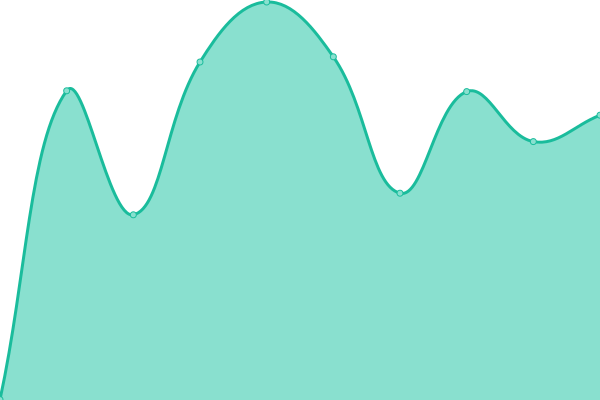
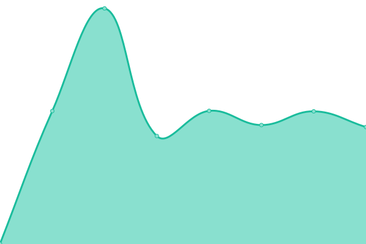

# [📈 Live Status](https://aldo1066.github.io/Uptime): <!--live status--> **🟩 All systems operational**

This repository contains the open-source uptime monitor and status page for [Kilian ](Kilian-Buss.me), powered by [Upptime](https://github.com/upptime/upptime).

With [Upptime](https://upptime.js.org), you can get your own unlimited and free uptime monitor and status page, powered entirely by a GitHub repository. We use [Issues](https://github.com/aldo1066/Uptime/issues) as incident reports, [Actions](https://github.com/aldo1066/Uptime/actions) as uptime monitors, and [Pages](https://aldo1066.github.io/Uptime) for the status page.

<!--start: status pages-->
<!-- This summary is generated by Upptime (https://github.com/upptime/upptime) -->
<!-- Do not edit this manually, your changes will be overwritten -->
<!-- prettier-ignore -->
| URL | Status | History | Response Time | Uptime |
| --- | ------ | ------- | ------------- | ------ |
|  [BOS Fahrzeug Info](https://bos-fahrzeuge.info/) | 🟩 Up | [bos-fahrzeug-info.yml](https://github.com/aldo1066/Uptime/commits/HEAD/history/bos-fahrzeug-info.yml) | 

 879ms
     
 | 

<a href="https://aldo1066.github.io/Uptime/history/bos-fahrzeug-info">100.00%</a>
    

|  [IServ](https://kgsgronau.de/iserv) | 🟩 Up | [i-serv.yml](https://github.com/aldo1066/Uptime/commits/HEAD/history/i-serv.yml) | 

 1369ms
     
 | 

<a href="https://aldo1066.github.io/Uptime/history/i-serv">100.00%</a>
    

|  [Stud.IP NLBK](https://www.studip.nlbk.niedersachsen.de/) | 🟩 Up | [stud-ip-nlbk.yml](https://github.com/aldo1066/Uptime/commits/HEAD/history/stud-ip-nlbk.yml) | 

 951ms
     
 | 

<a href="https://aldo1066.github.io/Uptime/history/stud-ip-nlbk">100.00%</a>
    

|  [Jellyfin](https://jelly.braunschweiger.info/) | 🟩 Up | [jellyfin.yml](https://github.com/aldo1066/Uptime/commits/HEAD/history/jellyfin.yml) | 

 742ms
     
 | 

<a href="https://aldo1066.github.io/Uptime/history/jellyfin">99.05%</a>
    

|  [Jellyseerr](https://jellyseerr.braunschweiger.info/) | 🟩 Up | [jellyseerr.yml](https://github.com/aldo1066/Uptime/commits/HEAD/history/jellyseerr.yml) | 

 925ms
     
 | 

<a href="https://aldo1066.github.io/Uptime/history/jellyseerr">99.05%</a>
    

<!--end: status pages-->

[**Visit our status website →**](https://aldo1066.github.io/Uptime)

## 📄 License

- Powered by: [Upptime](https://github.com/upptime/upptime)
- Code: [MIT](./LICENSE) © [Anand Chowdhary](https://anandchowdhary.com), supported by [Pabio](https://pabio.com)
- Data in the `./history` directory: [Open Database License](https://opendatacommons.org/licenses/odbl/1-0/)
